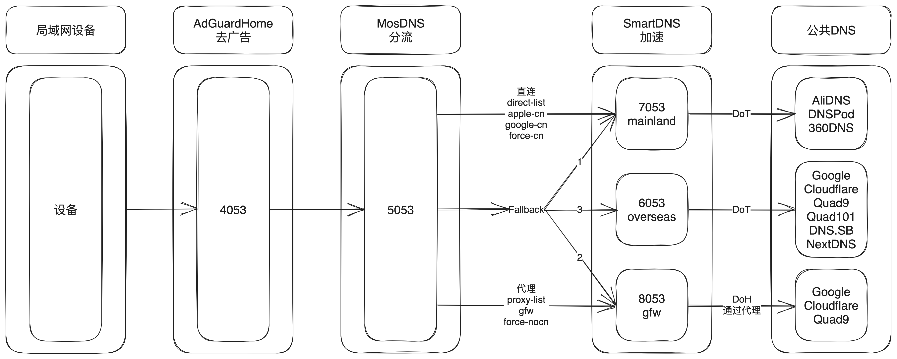

# NestingDNS
DNS 三大神器 [AdGuardHome](https://github.com/AdguardTeam/AdGuardHome)、[MosDNS](https://github.com/IrineSistiana/mosdns)、[SmartDNS](https://github.com/pymumu/smartdns)，该如何选择？  
不，小孩子才做选择，我全都要。  
于是有了这个项目，套娃使用三大神器，试图找到一套最佳实践。

# DNS 解析流程
1. AdGuardHome 为第一层 DNS ，作为整体入口，监听端口 4053。
- 负责去广告。
2. MosDNS 为第二层 DNS，监听端口 5053。
- 负责分流。
    - 直连：待解析域名在 [direct-list.txt](https://raw.githubusercontent.com/Loyalsoldier/v2ray-rules-dat/release/direct-list.txt)、[apple-cn.txt](https://raw.githubusercontent.com/Loyalsoldier/v2ray-rules-dat/release/apple-cn.txt)、[google-cn.txt](https://raw.githubusercontent.com/Loyalsoldier/v2ray-rules-dat/release/google-cn.txt)、force-cn.txt(自定义不走代理的域名)内，通过 SmartDNS 的 mainland 组进行解析。
    - 代理：待解析域名在 [proxy-list.txt](https://raw.githubusercontent.com/Loyalsoldier/v2ray-rules-dat/release/proxy-list.txt)、[gfw.txt](https://raw.githubusercontent.com/Loyalsoldier/v2ray-rules-dat/release/gfw.txt)、[greatfire.txt](https://raw.githubusercontent.com/Loyalsoldier/v2ray-rules-dat/release/greatfire.txt)、force-nocn.txt(自定义走代理的域名)内，通过 SmartDNS 的 gfw 组进行解析。
    - Fallback：待解析域名不在以上规则内的，先使用 SmartDNS 的 mainland 组进行解析，如解析出来的地址为国内 IP(在 [CN-ip-cidr.txt](https://raw.githubusercontent.com/Hackl0us/GeoIP2-CN/release/CN-ip-cidr.txt) 内)则使用，否则抛弃。再使用 SmartDNS 的 gfw 组进行解析，如解析成功则使用，如失败则使用 SmartDNS 的 overseas 组进行解析（gfw 组使用代理连接公共 DNS，当代理异常时使用 overseas 组作为备用进行解析）。
3. SmartDNS 为第三层 DNS，监听端口 6053、7053、8053
- 负责 DNS 解析、测速、缓存。
    - mainland 组，端口 7053，通过 DoT 接入上游 AliDNS、DNSPod、360DNS，负责直连域名解析。
    - gfw 组，端口 8053，通过代理使用 DoH 接入上游 Google、Cloudflare、Quad9，负责代理域名解析。
    - overseas 组，端口 6053，通过 DoT 接入上游 Google、Cloudflare、Quad9、Quad101、DNS.SB、NextDNS，作为备用域名解析。



# 安装方法
使用 Docker 一键安装。  
1. network host 模式（推荐使用）
```bash
docker run -d \
    --restart unless-stopped \
    --name nestingdns \
    --network host \
    -v $HOME/nestingdns/etc:/nestingdns/etc \    # 配置文件路径
    -v $HOME/nestingdns/work:/nestingdns/work \  # 工作文件路径
    -v $HOME/nestingdns/log:/nestingdns/log \    # 日志文件路径
    -e TZ=Asia/Shanghai \
    -e SCHEDULE="0  4  *  *  *" \  # 每天 4 点更新规则文件，重启 MosDNS
    217heidai/nestingdns
```

2. 端口映射模式（MosDNS、SmartDNS 的端口可以不映射）
```bash
docker run -d \
    --restart unless-stopped \
    --name nestingdns \
    -p 3000:3000 \      # AdGuardHome web 页面
    -p 4053:4053 \      # AdGuardHome NDS
    -p 4053:4053/udp \  # AdGuardHome NDS
    -p 5053:5053 \      # MosDNS NDS
    -p 5053:5053/udp \  # MosDNS NDS
    -p 6053:6053 \      # SmartDNS NDS
    -p 6053:6053/udp \  # SmartDNS NDS
    -p 7053:7053 \      # SmartDNS NDS
    -p 7053:7053/udp \  # SmartDNS NDS
    -p 8053:8053 \      # SmartDNS NDS
    -p 8053:8053/udp \  # SmartDNS NDS
    -v $HOME/nestingdns/etc:/nestingdns/etc \    # 配置文件路径
    -v $HOME/nestingdns/work:/nestingdns/work \  # 工作文件路径
    -v $HOME/nestingdns/log:/nestingdns/log \    # 日志文件路径
    -e TZ=Asia/Shanghai \
    -e SCHEDULE="0  4  *  *  *" \  # 每天 4 点更新配置文件，重启 MosDNS
    217heidai/nestingdns
```

# 配置说明
## AdGuardHome
AdGuardHome 配置文件为 `$HOME/nestingdns/etc/conf/adguardhome.yaml`。
- ***默认已配置好，一般无需调整***。
- 可通过 3000 端口的 web 进行配置，默认账号 root 密码 password。
- 已内置去广告规则 [AdBlock DNS Filters](https://github.com/217heidai/adblockfilters)。

## MosDNS
MosDNS 配置文件为 `$HOME/nestingdns/etc/conf/mosdns.yaml`、`$HOME/nestingdns/etc/conf/mosdns_load_rules.yaml`、`$HOME/nestingdns/etc/conf/mosdns_forward.yaml`。
- ***默认已配置好，一般无需调整***。各项配置可参考官方 [wiki](https://irine-sistiana.gitbook.io/mosdns-wiki/)。
- 分流规则文件路径为 `$HOME/nestingdns/etc/site/`。根据创建容器时的 SCHEDULE 参数，定时下载更新分流规则文件，默认每天 4 点更新。
- 自定义不走代理规则文件为 `$HOME/nestingdns/etc/site/force-cn.txt`。默认为空，可自行添加内容，如填入 VPS 的域名。
- 自定义走代理规则文件为 `$HOME/nestingdns/etc/site/force-nocn.txt`。默认为空，可自行添加内容。
- gfw TTL 默认修改为 600s，`$HOME/nestingdns/etc/conf/mosdns_forward.yaml` 中设置 sequence dns_gfw，***如有多个代理地址切换使用的，请设置较小值，如 60***。（上游 smartdns gfw 组默认已关闭缓存、测速）
- ECS (EDNS0 Client Subnet) ，默认关闭。如需启用，请在 `$HOME/nestingdns/etc/conf/mosdns_forward.yaml` 中找到 ecs_us，设置为 VPS 所在地 IP，并放开调用前的注释。
- CDN IP 优选，默认关闭。如需启用，请在 `$HOME/nestingdns/etc/conf/mosdns_forward.yaml` 中找到所有 best_ip，删掉注释，并设置相应 black_hole ip（建议多填几个不同网段的 ip）。测速工具推荐使用 [CloudflareSpeedTest](https://github.com/XIU2/CloudflareSpeedTest)（注意测速必须关闭代理）。由于测速需关闭代理，因此未做成自动化脚本，请定期手工测速。
    - cloudflare 优选，请将测速较快的 ip 填入 `$HOME/nestingdns/etc/conf/mosdns_forward.yaml` 中 sequence blackhole_cloudflare。

## SmartDNS
SmartDNS 配置文件为 `$HOME/nestingdns/etc/conf/smartdns.conf`。
- **除代理外，其它默认已配置好，一般无需调整**。各项配置可参考官方 [wiki](https://pymumu.github.io/smartdns/)。
- **使用科学上网的，请为 gfw 组配置通过代理进行 DNS 解析**，配置方式参见官方 [wiki proxy 部分](https://pymumu.github.io/smartdns/config/proxy/)。不使用科学上网的，无需配置。

# 测试方法
```
dig @ip -p 4053 www.baidu.com
```